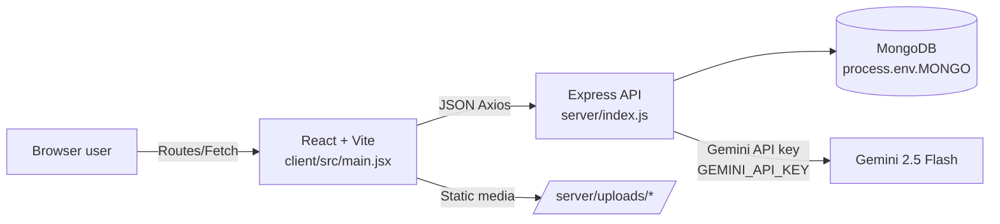

# PracticeQuiz Technical Overview

## Mục lục
1. A. Executive Summary  
2. B. System Architecture  
3. C. Frontend Flow (UI + Routing)  
4. D. Backend/API Workflow  
5. E. Database Schema  
6. F. AI Layer: Gemini  
7. G. AI Layer: Llama  
8. H. Security, Reliability, Observability  
9. I. Local Development & Deployment  
10. J. Appendix  

---

## A. Executive Summary
- PracticeQuiz là ứng dụng luyện thi TOEIC gồm các module: TOEIC Listening & Reading (trắc nghiệm), TOEIC Writing (AI chấm điểm), Coach/Luyện nhanh, Prediction, Auth/Profile, Admin (quản lý user/set/question), Game (placeholder).  
- Kiến trúc: frontend React + Vite (`client/src`), backend Node/Express (`server/index.js`) kết nối MongoDB (`server/utils/connectDB.js`), AI chấm TOEIC Writing bằng Gemini (`server/utils/writingGrader.js`).  
- Cổng mặc định: API `PORT||3000` (`server/index.js`), frontend Vite 5173 (`client/.env`), FE gọi API base `http://localhost:11111` nếu không set `VITE_API_ENDPOINT` (`client/src/utils/apiRequest.js`).  
- Dữ liệu TOEIC MCQ & Writing lưu MongoDB qua các model ToeicSet/ToeicQuestion/ToeicAttempt và ToeicWritingSet/ToeicWritingQuestion/ToeicWritingAttempt (`server/models/*`).  
- Chấm Writing: gọi Gemini model `gemini-2.5-flash` khi nộp bài (`server/utils/writingGrader.js` được `submitWritingAttempt` trong `server/controllers/toeicWriting.controller.js` sử dụng).  

## B. System Architecture

- Tech stack: React 18, React Router 6, Ant Design 5, TanStack React Query, Zustand (FE); Express 4, Mongoose 8, express-fileupload, bcrypt/jsonwebtoken (BE).  
- Thư mục chính:  
  - Frontend: `client/src/routes` (layout, dashboard, practice, attempt, profile, auth, game), `client/src/components` (LeftBar, TopBar, PracticeCard), `client/src/utils` (apiRequest, toeicApi, localWritingApi, authStore).  
  - Backend: `server/controllers` (toeic, toeicWriting, user, admin, prediction), `server/routes`, `server/models`, `server/utils` (writingGrader, predictionService).  
- Static: `app.use("/uploads", express.static(...))` trong `server/index.js`.  

## C. Frontend Flow (UI + Routing)
- Routing gốc `client/src/main.jsx`: MainLayout bọc App (LeftBar + TopBar) + Outlet. Route chính: `/` dashboard, `/practice`, `/practice/:id`, `/attempt/:attemptId`, `/attempt/:attemptId/result`, `/attempt/:attemptId/review`, `/practice/writing`, `/practice/writing/:id`, `/attempt-writing/:attemptId`, `/attempt-writing/:attemptId/review`, `/practice/prediction`, `/practice/coach`, `/game`, `/auth`, `/profile/:username`.  
- Navigation: `client/src/components/leftBar/leftBar.jsx` điều hướng Dashboard/Coach/Practice MCQ/Practice Writing/Prediction; đổi theme light/dark (Zustand `client/src/store/themeStore.js`). `client/src/components/topBar/topBar.jsx` hiển thị user, điểm, logout xóa `pq_token` trong localStorage.  

### 1) Dashboard (`client/src/routes/dashboard/dashboard.jsx`)
- Dữ liệu: React Query gọi `getMyToeicRecentAttempts`, `getMyWritingRecentAttempts` (nếu có userId).  
- Hiển thị line chart, bảng chi tiết điểm, streak, daily goal; resume attempt từ `pq_last_attempt` localStorage.  

### 2) Practice TOEIC L&R
- Danh sách set: `client/src/routes/practice/practice.jsx` gọi `getToeicSets`; filter/sort/bookmark, gợi ý, resume attempt; lấy lịch sử `getMyToeicRecentAttempts`.  
- Chi tiết set: `client/src/routes/practice/practiceDetail.jsx` gọi `getToeicSet`, `getToeicLastResult`. Chọn part/time -> POST `/toeic/sets/:id/attempts` (`createToeicAttempt`); full test chọn tất cả part. Lưu `pq_last_attempt`, điều hướng `/attempt/:attemptId`.  
- Làm bài MCQ: `client/src/routes/attempt/attemptPage.jsx`  
  - Load meta `getToeicAttempt`, sau đó load câu hỏi theo part `getToeicQuestions` (GET `/toeic/sets/:setId/questions?part=`).  
  - Hiển thị layout nghe/đọc (passage/image/audio), đếm thời gian, đếm số câu đã trả lời.  
  - Nộp: POST `/toeic/attempts/:id/submit` (`submitToeicAttempt`) -> chuyển trang kết quả.  
- Kết quả: `client/src/routes/practice/ToeicResultPage.jsx` hiển thị điểm tổng/part, nút xem review `/attempt/:id/review`.  
- Review: `client/src/routes/practice/ToeicReviewPage.jsx` gọi `getToeicAttemptReview` -> hiển thị câu hỏi, đáp án user vs đúng, giải thích, ước tính Listening/Reading ~990.  

### 3) Practice TOEIC Writing
- Danh sách set: `client/src/routes/practice/practiceWriting.jsx` gọi `listWritingSets` (GET `/toeic-writing/sets`).  
- Chi tiết set: `client/src/routes/practice/practiceWritingDetail.jsx` gọi `getWritingSet`, `getWritingLastAttempt`. Chọn part/time -> POST `/toeic-writing/sets/:id/attempts` (`createWritingAttempt`) -> điều hướng `/attempt-writing/:attemptId`.  
- Làm bài Writing: `client/src/routes/attempt/attemptWritingPage.jsx`  
  - Load meta `getWritingAttempt` + câu hỏi `getWritingQuestionsOfSet` (GET `/toeic-writing/sets/:setId/questions`), lọc theo selectedParts.  
  - Nộp cách 1 (Gemini): `submitWritingAttempt` (POST `/toeic-writing/attempts/:attemptId/submit`) -> server gọi Gemini, điều hướng về trang set.  
  - Nộp cách 2 (Llama offline): gọi local service `scoreWritingLocal` (`client/src/utils/localWritingApi.js`, mặc định `VITE_LOCAL_WRITING_URL=http://localhost:3001/local-writing-score`) để lấy điểm, sau đó POST `/toeic-writing/attempts/:attemptId/submit-llama` với answers + llamaAnswers -> review.  
  - Nộp hybrid: chạy song song Gemini server + Llama offline, chuyển review mang kèm local score.  
- Review: `client/src/routes/practice/ToeicWritingReviewPage.jsx` gọi `getWritingAttemptReview`; hiển thị summary (predicted TOEIC, overall, submissionMethod), so sánh Gemini vs Llama offline (nếu có), feedback/criteria từng câu. Có nút chấm lại bằng Llama offline.  

### 4) Coach & Prediction
- Coach: `client/src/routes/practice/practiceCoach.jsx` đọc lịch sử, tìm part yếu, gợi ý set và drill nhanh (tự tạo attempt part lẻ POST `/toeic/sets/:id/attempts`).  
- Prediction: `/practice/prediction` (component `prediction.jsx`) đọc `/prediction/my/latest` (dựa trên `server/utils/predictionService.js`).  

### 5) Game
- `/game` (`client/src/routes/game/game.jsx`): placeholder “Danh sách room…” chưa có API.  

### 6) Auth & Profile
- Auth page: `client/src/routes/authPage/authPage.jsx` gọi `/user/register` hoặc `/user/login`; lưu token vào Zustand `authStore` + localStorage `pq_token`.  
- Profile: `client/src/routes/profile/profilePage.jsx` cập nhật username (PATCH `/user/profile`), upload avatar (POST `/user/avatar` multipart, ghép `API_BASE`), đổi mật khẩu (POST `/user/change-password`); bảng lịch sử TOEIC (`/toeic/my/recent-attempts`) & Writing (`/toeic-writing/my/recent-attempts`).  

## D. Backend/API Workflow

### Auth (`server/controllers/user.controller.js`, `server/routes/user.route.js`)
- Đăng ký: POST `/user/register` (username, displayName, email, password) -> bcrypt hash -> tạo User -> trả JWT (`JWT_SECRET`).  
- Đăng nhập: POST `/user/login` -> kiểm tra mật khẩu -> trả token + user.  
- Me: GET `/user/me` (Bearer) -> trả thông tin user (ẩn hashedPassword).  
- Cập nhật profile: PATCH `/user/profile` (Bearer) -> cập nhật displayName/username (check trùng).  
- Avatar: POST `/user/avatar` (Bearer, fileupload) -> lưu `/uploads/avatars/*`, cập nhật profileImage.  
- Đổi mật khẩu: POST `/user/change-password` (Bearer) -> xác thực mật khẩu cũ -> hash mới.  

### TOEIC L&R (`server/controllers/toeic.controller.js`, `server/routes/toeic.route.js`)
- Danh sách set: GET `/toeic/sets` (status=published).  
- Chi tiết set: GET `/toeic/sets/:id`.  
- Tạo attempt: POST `/toeic/sets/:id/attempts` (Bearer) với `selectedParts[]`, `timeLimitSec?` -> tạo ToeicAttempt, tăng stats.attempts.  
- Chi tiết attempt: GET `/toeic/attempts/:id` -> meta set, selectedParts, timeLimit, trạng thái, điểm nếu có.  
- Attempt gần nhất theo set: GET `/toeic/sets/:id/last-attempt` (Bearer).  
- Câu hỏi user: GET `/toeic/sets/:id/questions?part=` -> trả id/number/part/choices/media/passage.  
- Nộp bài: POST `/toeic/attempts/:id/submit` (Bearer) answers [{questionId, selectedOption}] -> tính scoreByPart, totalCorrect, mode full/parts, lưu status=submitted, trả summary.  
- Review: GET `/toeic/attempts/:id/review` (Bearer) -> trả attempt + danh sách câu (userAnswer, correct, giải thích, media).  
- Admin: CRUD set/question, import, upload ảnh/audio tại `/toeic/admin/*` (Bearer + requireAdmin).  

### TOEIC Writing (`server/controllers/toeicWriting.controller.js`, `server/routes/toeicWriting.route.js`)
- Danh sách/chi tiết set: GET `/toeic-writing/sets`, GET `/toeic-writing/sets/:id`.  
- Tạo attempt: POST `/toeic-writing/sets/:id/attempts` (Bearer) với selectedParts/timeLimitSec.  
- Chi tiết attempt: GET `/toeic-writing/attempts/:id` (Bearer) -> meta, submissionMethod, llamaResult nếu có.  
- Câu hỏi: GET `/toeic-writing/sets/:setId/questions?part=` -> prompt, wordPair/image, instructions, min/max words, rubric.  
- Nộp Gemini: POST `/toeic-writing/attempts/:attemptId/submit` (Bearer) answers -> gọi `gradeWriting` (Gemini) cho từng câu, tính trung bình, predictedToeicScore, lưu summary, submissionMethod="gemini".  
- Nộp Llama (client cung cấp AI): POST `/toeic-writing/attempts/:attemptId/submit-llama` (Bearer) với answers + llamaAnswers/llamaResult -> normalize điểm (`normalizeLlamaScore`), lưu summary, llamaResult, submissionMethod="llama". Không có lệnh gọi Llama trên server.  
- Attempt gần nhất: GET `/toeic-writing/sets/:id/last-attempt` (Bearer).  
- Lịch sử user: GET `/toeic-writing/my/recent-attempts` (Bearer).  
- Review: GET `/toeic-writing/attempts/:id/review` (Bearer) -> summary + danh sách câu, AI feedback (Gemini hoặc Llama).  
- Admin Writing: CRUD set/question, import, upload ảnh `/toeic-writing/admin/*` (Bearer + requireAdmin).  

### Prediction (`server/controllers/prediction.controller.js`)
- GET `/prediction/my/latest` (Bearer) -> `buildUserPrediction` tổng hợp ToeicAttempt + ToeicWritingAttempt, dự đoán Listening/Reading/Writing, confidence, missing.  

### Admin
- Quản lý user: `/admin/users` list/update/delete/reset points (Bearer + requireAdmin) (`server/controllers/admin.controller.js`).  
- Thống kê: `/admin/stats/overview` -> tổng số, trung bình, fallback AI count (`server/controllers/adminStats.controller.js`).  

## E. Database Schema (MongoDB/Mongoose)
- `User` (`server/models/user.model.js`): displayName, username, email, profileImage, hashedPassword, points, role ("user"/"admin"), status.  
- `ToeicSet` (`server/models/toeicSet.model.js`): _id, title, durationSec, totalQuestions, parts[{key,name,questions,tags,order}], isFree, status, stats{attempts,comments}, createdBy.  
- `ToeicQuestion` (`server/models/toeicQuestion.model.js`): setId, partKey (p1..p7), number (unique per set/part), questionText, choices[{label,text}], correctOption, explanation, imageUrl, audioUrl, passageId/passageOrder/passageText.  
- `ToeicAttempt` (`server/models/toeicAttempt.model.js`): setId, userId, mode(full/parts), selectedParts[], timeLimitSec, answers[{questionId,selectedOption,isCorrect,partKey}], scoreByPart[{partKey,correct,total,percent}], totalQuestions, totalCorrect, scorePercent, scoreRaw, status, startedAt/submittedAt.  
- `ToeicWritingSet` (`server/models/toeicWritingSet.model.js`): _id, title, durationSec, totalQuestions (default 8), isFree, parts (w1_5,w6_7,w8), description/level/year/source/tags, status, stats{attempts,comments,avgScore}.  
- `ToeicWritingQuestion` (`server/models/toeicWritingQuestion.model.js`): setId, number, partKey (w1_5/w6_7/w8), taskType (picture/email/opinion_essay/other), prompt, subPrompt/wordPair, imageUrl, instructions, minWords/maxWords, rubric, groupKey, tags.  
- `ToeicWritingAttempt` (`server/models/toeicWritingAttempt.model.js`): userId, setId, mode(full/part), selectedParts[], timeLimitSec, isSubmitted, submissionMethod ("gemini"/"llama"), answers[{questionId,number,partKey,taskType,answerText,wordCount,ai{scores,bands,feedback,studyPlan}}], summary{totalQuestions,answered,avgTaskScore,avgGrammarScore,avgVocabularyScore,avgOrganizationScore,avgOverallScore,predictedToeicScore}, llamaResult{overall,predictedToeicScore,criteria,feedback,studyPlan,suggestions,summary,raw}.  
- `AdminAudit` (utils) không nằm trong luồng chính.  

## F. AI Layer: Gemini (Writing)
- File: `server/utils/writingGrader.js`; được gọi trong `submitWritingAttempt` ( `server/controllers/toeicWriting.controller.js`).  
- Model: Gemini 2.5 Flash endpoint `.../gemini-2.5-flash:generateContent` với `GEMINI_API_KEY`.  
- Request: systemInstruction tiếng Việt + nội dung prompt/answer/rubric; body `contents:[{parts:[{text: systemInstruction + userContent}]}]`. Timeout `GEMINI_TIMEOUT_MS` (mặc định 15000ms) qua AbortController. Giới hạn ngày `GEMINI_MAX_CALLS_PER_DAY` (0 = không giới hạn); cache theo hash prompt/answer/rubric.  
- Parse: lấy text ứng viên đầu, tách JSON (remove code block `extractJson`), fallback số an toàn 3/120, predictedToeicScore fallback từ overall 0-200, map level 1-8 (`mapToeicWritingLevel`).  
- Contract trả về mỗi câu: `{taskScore, grammarScore, vocabularyScore, organizationScore, overallScore, predictedToeicScore, toeicWritingLevel, bands{task,grammar,vocabulary,organization}, studyPlan[], feedback, level, fallback?}`.  
- Fallback: parse/HTTP error hoặc hết quota -> `FALLBACK_RESULT` (score=3, predicted=120, level=4, studyPlan mặc định, feedback fallback, `fallback:true`).  
- Error handling: log parse error + raw text, HTTP non-OK ném lỗi, response rỗng ném lỗi; catch cuối trả fallback.  
- Env: bắt buộc `GEMINI_API_KEY`; tùy chọn `GEMINI_MAX_CALLS_PER_DAY`, `GEMINI_TIMEOUT_MS`.  

## G. AI Layer: Llama
- Tìm “llama”: không có gọi model server-side. Các điểm liên quan:  
  - FE chấm cục bộ: `client/src/utils/localWritingApi.js` POST `VITE_LOCAL_WRITING_URL` (mặc định `http://localhost:3001/local-writing-score`) ghi chú “Ollama local”, dùng trong `attemptWritingPage.jsx` và review.  
  - Server endpoint `/toeic-writing/attempts/:attemptId/submit-llama` (`server/controllers/toeicWriting.controller.js`) chỉ nhận payload AI từ client, normalize qua `normalizeLlamaScore` (map 0-5, snap 0-200, feedback/studyPlan fallback). Không có hàm gọi Llama model.  
- Trạng thái: **Chưa tích hợp Llama inference trong code** (chỉ nhận kết quả từ dịch vụ ngoài).  
- Đề xuất tích hợp:  
  1) Local Ollama: tạo `server/utils/llamaClient.js` gọi `http://localhost:11434/api/generate` (model `llama3:8b`) hàm `scoreWriting({prompt,answer})` trả JSON {criteria,overall,predictedToeicScore,feedback,studyPlan}, dùng lại `normalizeLlamaScore`; gọi trong `submitWritingAttemptLlama` khi không có `llamaAnswers` để tự chấm offline; fallback sang Gemini khi lỗi/quota.  
  2) Hosted inference (Groq/Replicate/Together): `llamaClient.js` gọi SDK/HTTP có cache theo hash prompt/answer, retry 429/5xx, fallback `gradeWriting`; cấu hình qua env `LLAMA_API_KEY`, `LLAMA_MODEL`, `LLAMA_ENDPOINT`.  

## H. Security, Reliability, Observability
- Auth: JWT Bearer (`Authorization: Bearer <token>`), middleware `server/middlewares/verifyToken.js`; token lưu localStorage `pq_token` + persist Zustand (`pq-auth`).  
- CORS: `server/index.js` chỉ cho `http://localhost:5173` và `http://localhost:5174`, `credentials:true`.  
- Upload: avatar, ảnh/audio câu hỏi, ảnh writing lưu `server/uploads/*`; kiểm MIME cơ bản.  
- Logging: `console.error` ở controllers, Gemini parse/HTTP error log, middleware cuối log “Server error:”.  
- Rate/quota: chỉ có quota Gemini optional; chưa có rate-limit HTTP.  
- Rủi ro: prompt injection (prompt/answer đẩy vào Gemini chưa lọc), dữ liệu nhạy cảm trong bài viết; token trong localStorage dễ bị XSS; chưa có CSRF; quota Gemini có thể chạm fallback; Llama offline phụ thuộc dịch vụ ngoài.  

## I. Local Development & Deployment
- Biến môi trường:  
  - Backend `.env`: `PORT` (mặc định 3000), `MONGO` (URI Mongo), `JWT_SECRET`, `GEMINI_API_KEY`, tùy chọn `GEMINI_MAX_CALLS_PER_DAY`, `GEMINI_TIMEOUT_MS`.  
  - Frontend `.env`: `VITE_API_ENDPOINT` (mặc định `http://localhost:11111`), `CLIENT_URL`, `VITE_LOCAL_WRITING_URL` (service Llama offline).  
- Chạy backend: `cd server && npm install && npm run dev` (node --watch) -> API `PORT||3000`.  
- Chạy frontend: `cd client && npm install && npm run dev` -> Vite 5173 (khớp CORS). Admin client tương tự `cd admin-client && npm run dev` (thường 5174).  
- Kết nối API: chỉnh `VITE_API_ENDPOINT` nếu backend khác port.  
- Triển khai: chưa thấy cấu hình deploy (không có vercel/railway).  

## J. Appendix

### Frontend Routes – Component
| Route | Component | Mô tả |
| --- | --- | --- |
| `/` | `client/src/routes/dashboard/dashboard.jsx` | Dashboard thống kê, chart, lịch sử. |
| `/practice` | `client/src/routes/practice/practice.jsx` | Danh sách set TOEIC MCQ, filter/sort. |
| `/practice/:id` | `client/src/routes/practice/practiceDetail.jsx` | Chi tiết set, chọn part/time, tạo attempt. |
| `/attempt/:attemptId` | `client/src/routes/attempt/attemptPage.jsx` | Làm bài TOEIC MCQ, nộp. |
| `/attempt/:attemptId/result` | `client/src/routes/practice/ToeicResultPage.jsx` | Kết quả MCQ. |
| `/attempt/:attemptId/review` | `client/src/routes/practice/ToeicReviewPage.jsx` | Review MCQ chi tiết. |
| `/practice/writing` | `client/src/routes/practice/practiceWriting.jsx` | Danh sách set Writing. |
| `/practice/writing/:id` | `client/src/routes/practice/practiceWritingDetail.jsx` | Chi tiết set Writing, tạo attempt. |
| `/attempt-writing/:attemptId` | `client/src/routes/attempt/attemptWritingPage.jsx` | Làm bài Writing, nộp Gemini/Llama. |
| `/attempt-writing/:attemptId/review` | `client/src/routes/practice/ToeicWritingReviewPage.jsx` | Review Writing, so sánh Gemini/Llama. |
| `/practice/coach` | `client/src/routes/practice/practiceCoach.jsx` | Đề xuất luyện nhanh. |
| `/practice/prediction` | `client/src/routes/practice/prediction.jsx` | Xem điểm dự đoán. |
| `/auth` | `client/src/routes/authPage/authPage.jsx` | Login/Register. |
| `/profile/:username` | `client/src/routes/profile/profilePage.jsx` | Cập nhật thông tin, xem lịch sử. |
| `/game` | `client/src/routes/game/game.jsx` | Placeholder game. |

### Backend Endpoint – Controller – Model
| Endpoint | Method | Controller | Model liên quan |
| --- | --- | --- | --- |
| `/user/register` | POST | `user.controller.register` | User |
| `/user/login` | POST | `user.controller.login` | User |
| `/user/me` | GET (Bearer) | `user.controller.getMe` | User |
| `/user/profile` | PATCH (Bearer) | `user.controller.updateProfile` | User |
| `/user/avatar` | POST (Bearer, file) | `user.controller.uploadAvatar` | User |
| `/user/change-password` | POST (Bearer) | `user.controller.changePassword` | User |
| `/toeic/sets` | GET | `toeic.controller.listSets` | ToeicSet |
| `/toeic/sets/:id` | GET | `toeic.controller.getSet` | ToeicSet |
| `/toeic/sets/:id/attempts` | POST (Bearer) | `toeic.controller.createAttempt` | ToeicAttempt |
| `/toeic/attempts/:id` | GET | `toeic.controller.getAttempt` | ToeicAttempt, ToeicSet |
| `/toeic/attempts/:id/submit` | POST (Bearer) | `toeic.controller.submitAttempt` | ToeicAttempt, ToeicQuestion |
| `/toeic/attempts/:id/review` | GET (Bearer) | `toeic.controller.getAttemptReview` | ToeicAttempt, ToeicQuestion |
| `/toeic/sets/:id/questions` | GET | `toeic.controller.listQuestionsForUser` | ToeicQuestion |
| `/toeic/my/recent-attempts` | GET (Bearer) | `toeic.controller.getMyToeicRecentAttempts` | ToeicAttempt |
| `/toeic-writing/sets` | GET | `toeicWriting.controller.listWritingSets` | ToeicWritingSet |
| `/toeic-writing/sets/:id` | GET | `toeicWriting.controller.getWritingSet` | ToeicWritingSet |
| `/toeic-writing/sets/:id/attempts` | POST (Bearer) | `toeicWriting.controller.createWritingAttempt` | ToeicWritingAttempt |
| `/toeic-writing/attempts/:id` | GET (Bearer) | `toeicWriting.controller.getWritingAttempt` | ToeicWritingAttempt, ToeicWritingSet |
| `/toeic-writing/sets/:setId/questions` | GET | `toeicWriting.controller.getWritingQuestions` | ToeicWritingQuestion |
| `/toeic-writing/attempts/:attemptId/submit` | POST (Bearer) | `toeicWriting.controller.submitWritingAttempt` | ToeicWritingAttempt, ToeicWritingQuestion |
| `/toeic-writing/attempts/:attemptId/submit-llama` | POST (Bearer) | `toeicWriting.controller.submitWritingAttemptLlama` | ToeicWritingAttempt |
| `/toeic-writing/attempts/:id/review` | GET (Bearer) | `toeicWriting.controller.getWritingAttemptReview` | ToeicWritingAttempt, ToeicWritingQuestion |
| `/toeic-writing/my/recent-attempts` | GET (Bearer) | `toeicWriting.controller.getMyWritingRecentAttempts` | ToeicWritingAttempt |
| `/prediction/my/latest` | GET (Bearer) | `prediction.controller.getMyLatestPrediction` | ToeicAttempt, ToeicWritingAttempt |
| `/admin/users` | GET/PATCH/DELETE (Bearer+Admin) | `admin.controller.*` | User |
| `/admin/stats/overview` | GET (Bearer+Admin) | `adminStats.controller.getAdminOverview` | User, ToeicAttempt, ToeicWritingAttempt |

### Lệnh dev hữu ích
- Backend: `cd server && npm run dev` (hoặc `npm start`).  
- Seed TOEIC: `npm run seed:toeic`.  
- Frontend: `cd client && npm run dev` (Vite).  
- Admin client: `cd admin-client && npm run dev`.  
